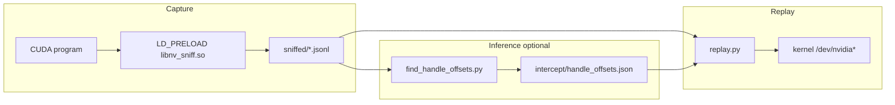
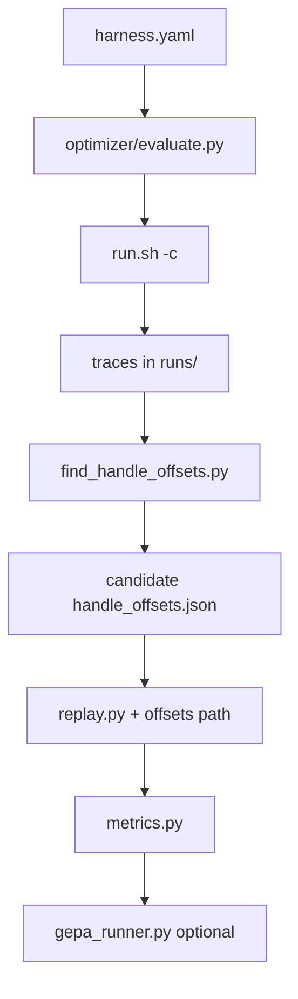

# Architecture — ioctl-cuda-mapping

## Current pipeline



## Optimizer layer (plan-v1)

Sits **beside** the pipeline: it does not change how capture or replay work.
It orchestrates repeated captures, writes candidate `handle_offsets.json`
under `optimizer/runs/<id>/`, replays with those candidates, and emits JSON
metrics (and optional GEPA optimization over harness YAML).



## Key files

| Path | Responsibility |
|------|------------------|
| `cuda-ioctl-map/intercept/nv_sniff.c` | Record ioctl buffers |
| `cuda-ioctl-map/replay/replay.py` | Re-issue ioctls with patching |
| `cuda-ioctl-map/tools/find_handle_offsets.py` | Pair traces → offset JSON |
| `cuda-ioctl-map/optimizer/evaluate.py` | Live evaluator + metrics export |
| `cuda-ioctl-map/optimizer/metrics.py` | Parse replay output, diff offsets |
| `cuda-ioctl-map/optimizer/scripts/smoke_plan_v2.sh` | [plan-v2.md](plan-v2.md) Phase 0 / 4 / optional 2–3 (vLLM) or Gemini (`GEPA_USE_GEMINI`); uses `OPT_PY` vs `OPT_VENV_PY` so unittest/evaluate and GEPA can use different interpreters if needed |
| `.github/workflows/optimizer-plan-v2-phase0.yml` | GitHub Actions: `SKIP_LIVE=1` smoke (unittest + `evaluate.py --dry-run`) on Ubuntu; no GPU |

## Data artifacts

- **Trace:** JSONL with `open` / `ioctl` lines (`before`/`after` hex).
- **Offsets:** JSON map keyed by `0xXXXXXXXX` ioctl request string.

## Effect-map subsystem (2026-07-30)

A second, independent path to the specification that does not use the
capture/replay loop at all. Where the original pipeline infers structure by
diffing two captures, this one **interrogates the loaded driver directly**.

```
 SDK headers (610)                     loaded driver (555.42.02)
        |                                        |
 extract_ctrl_table.py                  sweep_controls.c
  - names, classes                       - builds RM ladder, no root
  - sizeof() by compiled probe           - presence probe   -> 0x56 / 0x1F
        |                                - size scan        -> 0x57
        |                                        |
        +----------------> merge <---------------+
                             |
              abi_probe_all.jsonl  (the size authority)
                             |
        +--------------------+---------------------+
        |                    |                     |
  gen_sweep_list.py    classify_mig.py      (future) spec.json
  gen_templates.py            |
        |              mig-command-
  state_vector.jsonl   classification.md
        |
   noise_floor.py  -- A2 gate --> effect_map.json
        |                              ^
   run_effect_map.py + effect_probe.cu -+
```

**Components**

| File | Responsibility |
|---|---|
| `extract_ctrl_table.py` | Static command table. Sizes measured by compiling a probe, never by parsing C. |
| `sweep_controls.c` | The only component that talks to the driver. Ladder, sweep, presence probe, size scan. |
| `gen_sweep_list.py` | Safety filter, and the merge point where driver sizes override header sizes. |
| `gen_templates.py` | Request templates for index-list controls. |
| `effect_probe.cu` | Holds one CUDA operation open while the sweep runs. |
| `noise_floor.py` | The A2 gate. Builds the noise mask from a null diff. |
| `run_effect_map.py` | A3/A4. Op-vs-baseline and adjacent-rung views. |
| `classify_mig.py` | Joins static, driver and trace evidence into the MIG report. |

**Data flow.** One record shape throughout:
`{cmd, size, ret, errno, status, resp}` for a sweep, and
`{cmd, present, found_size, probe_status, accept_status}` for a probe.

**Relationship to the existing engine.** The effect-map path produces the
*size and presence* half of `spec.json`; the capture/replay path produces the
*field semantics* half. They meet at `build_schema.py`, which should take its
sizes from `abi_probe_all.jsonl` rather than from the headers.

## Version provenance — READ FIRST (2026-08-06)

Everything under `cuda-ioctl-map/tools/effectmap/out/` was measured against
driver **555.42.02**. hulk now runs **610.43.02**. Those artifacts are stale
until regenerated. No output file stamps its driver version, so the drift is
invisible. Fix the stamping when regenerating.

## Register plane (planned — `ouroboros-plan-v3.md` Lane A)

A third route to the specification, alongside capture/replay and the effect map.
The effect map asks the driver *what a command does*. The register plane asks the
hardware *what state the firmware left behind*.

```
  sweep_controls.c  --exec-reg-ops
         |
   NV2080_CTRL_CMD_GPU_EXEC_REG_OPS  (0x20800122, driver size 48)
         |
   regOffset 0x001404f8  = NV_PLTCG_LTC0_LTS0_L2_CACHE_ECC_UNCORRECTED_ERR_COUNT
         |
   read-only. Anchors the NV_PLTCG aperture (~0x140000) for later enumeration.
```

**Why it exists.** The GSP firmware decides the cache and channel assignment, and
that firmware is encrypted (measured: 64 MB at entropy 8.000, statistically
identical to `/dev/urandom` — see `gsp-firmware-re-assessment.md`). Reading the
registers the firmware programmed is the only route to that decision.

**Open risk.** Register-op validation is not in the open source. The Kernel RM
forwards the ops to the GSP, which checks a closed allowlist. Reachability for an
unprivileged client is an empirical question, not a source question.

**Constraint.** Reads only. Never issue a register write on hulk — it is shared.

**Relationship to the other planes.** The register plane is a *cross-check*, not
a replacement. `FB_GET_INFO_V2` already supplies the framebuffer topology through
the ordinary control path with no special permission. The register plane is what
you reach for when the control path does not expose a field.

## Framebuffer topology (measured, TU102, from the existing sweep)

Decoded from `out/state_vector_run1.jsonl`, command `0x20801303`. Measured under
555; re-measure under 610.

| Index | Field | Value |
|---|---|---|
| 0x04 | `PARTITION_COUNT` | 6 |
| 0x19 | `FBP_COUNT` | 6 |
| 0x14 | `PARTITION_MASK` | 0x3F |
| 0x0b | `BUS_WIDTH` | 384 |
| 0x1b | `L2CACHE_SIZE` | 6 MiB |
| 0x0d | `RAM_TYPE` | 17 (GDDR6) |
| 0x06 | `BANK_SWIZZLE_ALIGNMENT` | 64 KiB |

Bus width, RAM size and L2 size match published TITAN RTX specifications, which
validates the decode. `LTC_COUNT`, `LTS_COUNT`, `PSEUDO_CHANNEL_MODE` and
`LTC_MASK` sit at indices 0x22-0x2b and are **not yet measured** — the current
template stops at index 32.
