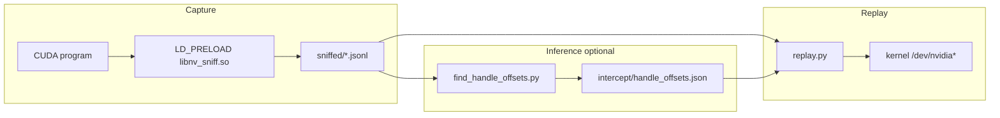
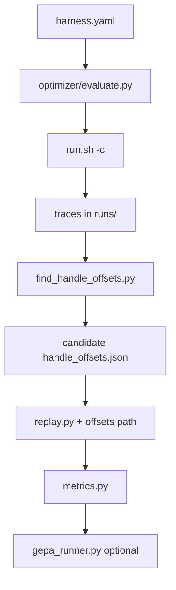

# Architecture — ioctl-cuda-mapping

## Current pipeline



## Optimizer layer (plan-v1)

Sits **beside** the pipeline: it does not change how capture or replay work.
It orchestrates repeated captures, writes candidate `handle_offsets.json`
under `optimizer/runs/<id>/`, replays with those candidates, and emits JSON
metrics (and optional GEPA optimization over harness YAML).



## Key files

| Path | Responsibility |
|------|------------------|
| `cuda-ioctl-map/intercept/nv_sniff.c` | Record ioctl buffers |
| `cuda-ioctl-map/replay/replay.py` | Re-issue ioctls with patching |
| `cuda-ioctl-map/tools/find_handle_offsets.py` | Pair traces → offset JSON |
| `cuda-ioctl-map/optimizer/evaluate.py` | Live evaluator + metrics export |
| `cuda-ioctl-map/optimizer/metrics.py` | Parse replay output, diff offsets |
| `cuda-ioctl-map/optimizer/scripts/smoke_plan_v2.sh` | [plan-v2.md](plan-v2.md) Phase 0 / 4 / optional 2–3 (vLLM) or Gemini (`GEPA_USE_GEMINI`); uses `OPT_PY` vs `OPT_VENV_PY` so unittest/evaluate and GEPA can use different interpreters if needed |
| `.github/workflows/optimizer-plan-v2-phase0.yml` | GitHub Actions: `SKIP_LIVE=1` smoke (unittest + `evaluate.py --dry-run`) on Ubuntu; no GPU |

## Data artifacts

- **Trace:** JSONL with `open` / `ioctl` lines (`before`/`after` hex).
- **Offsets:** JSON map keyed by `0xXXXXXXXX` ioctl request string.

## Effect-map subsystem (2026-07-30)

A second, independent path to the specification that does not use the
capture/replay loop at all. Where the original pipeline infers structure by
diffing two captures, this one **interrogates the loaded driver directly**.

```
 SDK headers (610)                     loaded driver (555.42.02)
        |                                        |
 extract_ctrl_table.py                  sweep_controls.c
  - names, classes                       - builds RM ladder, no root
  - sizeof() by compiled probe           - presence probe   -> 0x56 / 0x1F
        |                                - size scan        -> 0x57
        |                                        |
        +----------------> merge <---------------+
                             |
              abi_probe_all.jsonl  (the size authority)
                             |
        +--------------------+---------------------+
        |                    |                     |
  gen_sweep_list.py    classify_mig.py      (future) spec.json
  gen_templates.py            |
        |              mig-command-
  state_vector.jsonl   classification.md
        |
   noise_floor.py  -- A2 gate --> effect_map.json
        |                              ^
   run_effect_map.py + effect_probe.cu -+
```

**Components**

| File | Responsibility |
|---|---|
| `extract_ctrl_table.py` | Static command table. Sizes measured by compiling a probe, never by parsing C. |
| `sweep_controls.c` | The only component that talks to the driver. Ladder, sweep, presence probe, size scan. |
| `gen_sweep_list.py` | Safety filter, and the merge point where driver sizes override header sizes. |
| `gen_templates.py` | Request templates for index-list controls. |
| `effect_probe.cu` | Holds one CUDA operation open while the sweep runs. |
| `noise_floor.py` | The A2 gate. Builds the noise mask from a null diff. |
| `run_effect_map.py` | A3/A4. Op-vs-baseline and adjacent-rung views. |
| `classify_mig.py` | Joins static, driver and trace evidence into the MIG report. |

**Data flow.** One record shape throughout:
`{cmd, size, ret, errno, status, resp}` for a sweep, and
`{cmd, present, found_size, probe_status, accept_status}` for a probe.

**Relationship to the existing engine.** The effect-map path produces the
*size and presence* half of `spec.json`; the capture/replay path produces the
*field semantics* half. They meet at `build_schema.py`, which should take its
sizes from `abi_probe_all.jsonl` rather than from the headers.
