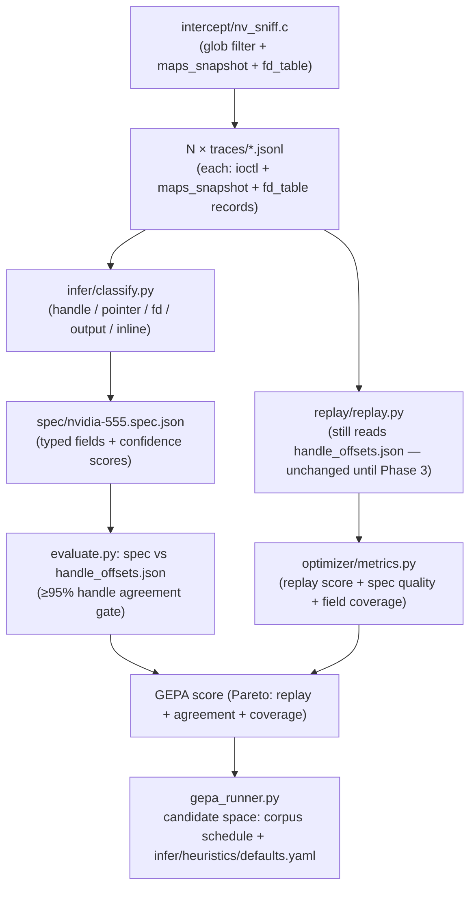

# plan-v3 — Generic Sniffer (Phase 1) and Inference Engine (Phase 2)

## Date

2026-05-10

## Purpose

Implement roadmap Phases 1 and 2 — the two open TODO items that currently
cap GEPA's candidate space to corpus schedule only.

- **Phase 1:** Generalise `intercept/nv_sniff.c` from a hardcoded
  `/dev/nvidia*` filter to a runtime-configurable glob list, and extend
  the JSONL schema with `/proc/self/maps` snapshots and fd-table snapshots
  that Phase 2 inference needs.
- **Phase 2:** Replace `tools/find_handle_offsets.py` (handles only, 2-trace
  diff) with a full `infer/classify.py` field classifier that emits a typed
  `spec.json` with confidence scores for every field kind the roadmap defines:
  handle, pointer, fd, output-region, inline-value. Extend the evaluator and
  GEPA candidate space to cover inference thresholds.

Neither phase breaks existing captures, replay, or the smoke scripts. Both
are gated by the regression guard already in `evaluate.py`.

---

## Execution Flow (target state after both phases)



---

## Phase 1 — Generic Sniffer

### 1.1  Device filter: runtime glob list

**File: `intercept/nv_sniff.c`**

Replace the hardcoded predicate:

```c
static int is_nvidia_path(const char *path) {
    return path && strncmp(path, "/dev/nvidia", 11) == 0;
}
```

with a runtime-configurable glob list:

```c
/* Parsed once in nv_sniff_init() from NV_SNIFF_DEVICES (colon-separated).
 * Default when unset: {"/dev/nvidia*"}.  Max 16 globs. */
#define MAX_GLOBS 16
static char *watched_globs[MAX_GLOBS];
static int   n_globs = 0;

static int is_watched_path(const char *path) {
    if (!path) return 0;
    for (int i = 0; i < n_globs; i++)
        if (fnmatch(watched_globs[i], path, 0) == 0) return 1;
    return 0;
}
```

`fnmatch(3)` is in `<fnmatch.h>` / glibc — no new link dependency. Add
`#include <fnmatch.h>` to the existing includes.

Parse `NV_SNIFF_DEVICES` in `nv_sniff_init()`:

```c
const char *devs = getenv("NV_SNIFF_DEVICES");
if (!devs) devs = "/dev/nvidia*";
/* split on ':' into watched_globs[], strdup each token */
```

Rename every call site from `is_nvidia_path` to `is_watched_path`. No other
logic changes.

**Backward compatibility:** when `NV_SNIFF_DEVICES` is unset the default
`/dev/nvidia*` glob matches exactly the same paths as the old prefix check.
Existing captures and replay are byte-for-byte identical.

### 1.2  JSONL schema extension

Two new record types are emitted alongside the existing `open` and `ioctl`
records. Existing parsers that only look at `ioctl` records ignore them and
the two new optional fields on ioctl records.

**`maps_snapshot` record** — emitted once per watched fd, on the first ioctl
for that fd:

```json
{
  "type": "maps_snapshot",
  "epoch": 0,
  "fd": 10,
  "dev": "/dev/nvidiactl",
  "maps": [
    {"start": "0x7f1234560000", "end": "0x7f1234570000",
     "perm": "r-xp", "path": "/usr/lib/x86_64-linux-gnu/libcuda.so.555.42.02"},
    ...
  ]
}
```

Read `/proc/self/maps` with `real_open` (not the hooked `open`) to avoid
recursion. Parse the standard six-field format line-by-line. Cap at 256
entries; emit a warning line if truncated.

**`fd_table` record** — emitted once, just before the first ioctl of the
whole process:

```json
{
  "type": "fd_table",
  "epoch": 0,
  "entries": [
    {"fd": 3,  "path": "/dev/urandom"},
    {"fd": 10, "path": "/dev/nvidiactl"},
    ...
  ]
}
```

Enumerate `/proc/self/fd/` with `opendir`/`readdir` (not hooked). Resolve
each entry with `readlink`. Cap at 256 entries.

**ioctl records gain two optional integer fields:**

```json
{"type":"ioctl","seq":5,"fd":10,"dev":"/dev/nvidiactl",
 "req":"0xC00846D6","sz":8,"before":"...","after":"...","ret":0,
 "maps_epoch":0,"fd_table_epoch":0}
```

`maps_epoch` is the epoch of the most-recently emitted `maps_snapshot` for
this fd. `fd_table_epoch` is always 0 in this phase (single snapshot at
process start; change-tracking is a future extension).

### 1.3  Acceptance tests

| Test | Command | Pass criterion |
|------|---------|----------------|
| Backward compat — existing smoke | `SKIP_LIVE=0 ./optimizer/scripts/smoke_plan_v2.sh` | cu_init 230/230, cu_mem_alloc 781/781 — identical to pre-Phase-1 |
| Default glob matches same paths | `NV_SNIFF_DEVICES` unset, run `run.sh -c programs/cu_init.cu` | JSONL ioctl records identical to current captures modulo the two new optional fields |
| Extended glob captures UVM | `NV_SNIFF_DEVICES=/dev/nvidiactl:/dev/nvidia-uvm run.sh -c programs/cu_init.cu` | `/dev/nvidia-uvm` ioctls appear in the output |
| `maps_snapshot` emitted | Parse new cu_init capture | At least one `maps_snapshot` record; `maps` array contains a `libcuda.so` entry |
| `fd_table` emitted | Parse new cu_init capture | Exactly one `fd_table` record at the start; entries include `/dev/nvidiactl` |

### 1.4  Phase 1B (stretch, not a gate for Phase 2): data-plane doorbell trap

The updated roadmap's Phase 1 also calls for hooking `mmap` and using
`mprotect`/`SIGSEGV` to capture GPU command-ring writes. This is **not
needed for Phase 2** — `classify.py` only needs the `maps_snapshot` address
ranges, not live doorbell events. Implement separately once Phase 2 is stable.

Key decisions when tackled:
- Hook `mmap()` in `nv_sniff.c`; emit `"type":"mmap"` record; store the
  returned range alongside the fd.
- After return, `mprotect(range, PROT_READ)` to remove write access.
- Install `SIGSEGV` handler via `sigaction(SA_SIGINFO)`: validate the fault
  address is in a watched mapping; log `"type":"doorbell"` with address and
  payload (decoded from the faulting instruction via `ucontext_t`); call
  `mprotect(PROT_READ|PROT_WRITE)`, execute the write, reprotect to
  `PROT_READ`.
- Gate the entire feature behind `NV_SNIFF_DOORBELL=1` — off by default.

---

## Phase 2 — Inference Engine v1

### 2.1  New directory layout

```
cuda-ioctl-map/
├── infer/
│   ├── __init__.py                 (empty)
│   ├── classify.py                 (main entry point + field classifier)
│   ├── heuristics/
│   │   └── defaults.yaml           (threshold config — GEPA mutates this)
│   └── tests/
│       ├── __init__.py
│       └── test_classify.py        (unit tests)
└── spec/
    ├── schema.json                 (JSON Schema meta-schema for spec files)
    └── .gitkeep                    (emitted .spec.json files not committed)
```

### 2.2  `infer/heuristics/defaults.yaml` — the new GEPA candidate space

```yaml
# Thresholds for each field classifier.  GEPA mutates these values.

handle:
  min_vary_count: 2        # minimum absolute vary count (from find_handle_offsets)
  min_vary_fraction: 0.05  # OR minimum fraction of total records (whichever larger)
  exclude_ptr_upper: true  # reject the lower half of a 64-bit pointer

pointer:
  map_lookup: true         # check buffer values against maps_snapshot ranges
  min_confidence: 0.80     # emit pointer field only if confidence >= this

fd:
  max_fd_value: 4096       # integers <= this that also appear in fd_table
  min_appear_fraction: 0.5 # must hold in >= this fraction of samples

output_region:
  before_after_differ: true  # bytes where after != before in the same call
```

These thresholds map 1-to-1 to parameters already implicit in
`find_handle_offsets.py` (`MIN_VARY_COUNT`, `MIN_VARY_FRACTION`, the
pointer-upper-half check). Externalising them into a YAML file is the only
change required to make them GEPA-mutable.

### 2.3  `infer/classify.py` — field classifier

**CLI:**

```bash
python3 infer/classify.py \
    sniffed/cu_init_a.jsonl sniffed/cu_init_b.jsonl [more.jsonl …] \
    --heuristics infer/heuristics/defaults.yaml \
    --out spec/nvidia-555.spec.json
```

**Algorithm per ioctl request code (four passes over the grouped records):**

1. **Output-region detection** (single-trace, highest priority):
   Per aligned 4-byte window: if `after[off:off+4] != before[off:off+4]`
   in any sample, mark as `output`.
   Confidence = fraction of samples where it changes.

2. **Pointer detection** (new):
   For each 4-byte window and each adjacent pair forming a 64-bit value:
   check whether the value falls within any address range from the nearest
   `maps_snapshot` record in the same trace. For 64-bit pointers the upper
   32 bits must match the `0x00007f??` canonical pattern.
   Confidence = (samples where value is in maps) / total_samples.
   Emit `pointer` if confidence ≥ `pointer.min_confidence`.

3. **fd detection** (new):
   For each 4-byte window: check if the value is a small non-zero integer
   ≤ `fd.max_fd_value` that also appears as a key in the `fd_table` record
   from the same capture. Emit `fd` if the condition holds in ≥
   `fd.min_appear_fraction` of samples.

4. **Handle detection** (port of `find_handle_offsets.py`):
   Per 4-byte window: non-zero in both runs, varies cross-run, passes the
   pointer-upper-half filter, count ≥ threshold derived from
   `handle.min_vary_count` and `handle.min_vary_fraction`.
   Confidence = vary_count / threshold.

5. **Inline-value** (fallback): every window not classified above.

**Priority when classifiers overlap the same window:**
`output > pointer > fd > handle > inline`

Classify at 4-byte granularity. Windows may be merged into contiguous spans
of the same kind before writing output.

**Output per ioctl request code:**

```json
{
  "0xC00846D6": {
    "name": "NV_ESC_CARD_INFO",
    "size": 8,
    "fields": [
      {"off": 0, "len": 4, "kind": "inline",  "confidence": 1.0},
      {"off": 4, "len": 4, "kind": "output",  "confidence": 0.95}
    ],
    "handle_offsets": [],
    "output_handle_offset": 4,
    "sample_count": 2,
    "examples": ["0000008000000000"]
  }
}
```

`handle_offsets` and `output_handle_offset` are derived directly from the
`fields` array (fields with `kind=handle` and `kind=output` respectively).
They are included for **backward compatibility** with `replay.py` and the
existing evaluator metrics — no consumer needs to be changed in this phase.

When `maps_snapshot` or `fd_table` records are absent from the input traces
(i.e., pre-Phase-1 captures), pointer and fd detection are skipped silently;
handle and output detection still run.

### 2.4  `spec/schema.json` — meta-schema

A JSON Schema (draft-07) document. Key constraints:
- Top level: `object`, keys matching `0x[0-9A-F]{8}`.
- Per entry: required `name` (string), `size` (integer ≥ 0), `fields`
  (array), `sample_count` (integer ≥ 0); optional `handle_offsets`
  (array of integers), `output_handle_offset` (integer), `examples`
  (array of hex strings).
- Per field object: required `off` (integer), `len` (integer ≥ 1), `kind`
  (enum: `handle`/`pointer`/`fd`/`size`/`inline`/`output`), `confidence`
  (number in [0, 1]).

### 2.5  Evaluator and harness integration

**`optimizer/harness.yaml`** — add an `infer:` stanza (default: off):

```yaml
infer:
  emit_spec: false                        # set true to run classify.py
  heuristics: infer/heuristics/defaults.yaml
  spec_out: spec/nvidia-555.spec.json
```

**`optimizer/evaluate.py`** — add `--emit-spec` flag. When enabled:

1. After the two captures, run:
   ```
   python3 infer/classify.py <run0.jsonl> <run1.jsonl>
       --heuristics <heuristics_path> --out <run_dir>/spec.json
   ```
2. Compare the emitted spec's `handle_offsets` and `output_handle_offset`
   fields against the checked-in `intercept/handle_offsets.json`.
3. Append spec quality fields to the evaluator JSON output:
   - `handle_agreement`: fraction of matching entries (per-ioctl exact match).
   - `field_coverage`: fraction of ioctl codes with at least one non-inline
     field.
   - `low_confidence_fields`: count of fields with confidence < 0.5.
4. Gate: if `handle_agreement < 0.95`, set `"ok": false` and include the
   disagreeing entries in the ASI diagnostics. (Applies only when
   `emit_spec: true`; the existing replay gate is unchanged.)

**`optimizer/metrics.py`** — add parsing for the three new fields and include
`handle_agreement` and `field_coverage` in the aggregate score. Weights are
additive alongside the existing replay score; initial values:
`handle_agreement × 0.2`, `field_coverage × 0.1`.

**GEPA candidate space expansion:** update `gepa_runner.py`'s reflection
prompt template to include the heuristics YAML content alongside harness.yaml,
so the model can propose threshold mutations (e.g. raise `pointer.min_confidence`,
lower `handle.min_vary_fraction`). Guard with `emit_spec: true` in the seed
harness — only runs that enable spec emission expose the richer candidate space.

### 2.6  Unit tests (`infer/tests/test_classify.py`)

Synthetic JSONL fixtures (no live GPU required):

| Test | What it checks |
|------|----------------|
| `test_handle_detected` | Two synthetic traces with varying non-zero values at offset 0 → classified as handle |
| `test_output_detected` | Single trace with `after[4:8] != before[4:8]` → classified as output |
| `test_pointer_detected` | Value at offset 8 within a maps_snapshot range → classified as pointer |
| `test_fd_detected` | Value 10 at offset 0, fd_table has entry for fd=10 → classified as fd |
| `test_inline_fallback` | No signal → all windows classified as inline |
| `test_priority_output_beats_handle` | Same window varies cross-run AND after≠before → output wins |
| `test_missing_maps_snapshot` | Trace without maps_snapshot records → pointer detection skipped, no crash |
| `test_backward_compat_fields` | Emitted spec has `handle_offsets` list consistent with `fields` array |

### 2.7  Acceptance tests

| Test | Command | Pass criterion |
|------|---------|----------------|
| Unit tests | `python3 -m unittest discover -s infer/tests -p 'test_*.py' -v` | All 8 pass |
| Classify cu_init (2 runs) | `python3 infer/classify.py sniffed/cu_init_a.jsonl sniffed/cu_init_b.jsonl --out /tmp/test.spec.json` | Exits 0; spec has ≥10 ioctl entries |
| Handle agreement | Evaluator with `--emit-spec` on harness.yaml | `handle_agreement ≥ 0.95` in output JSON |
| Pointer field present | Parse `/tmp/test.spec.json` | At least one field with `kind=pointer` (libcuda buffer pointer in NV_ESC_RM_CONTROL or similar) |
| fd field present | Parse `/tmp/test.spec.json` | At least one field with `kind=fd` for `0xC00446C9` (NV_ESC_REGISTER_FD, currently in KNOWN_FD_OFFSETS) |
| Evaluator with emit_spec | `python3 optimizer/evaluate.py --harness optimizer/harness.yaml --emit-spec` | `"ok": true`; `handle_agreement ≥ 0.95` |
| Replay regression guard unchanged | `SKIP_LIVE=0 ./optimizer/scripts/smoke_plan_v2.sh` | cu_init 230/230, cu_mem_alloc 781/781 |
| Schema validation | `python3 -c "import jsonschema, json; jsonschema.validate(json.load(open('/tmp/test.spec.json')), json.load(open('spec/schema.json')))"` | No exception |

---

## Risks and mitigations

| Risk | Mitigation |
|------|-----------|
| Phase 1 sniffer not yet capturing new fields when Phase 2 begins | `classify.py` degrades gracefully: skips pointer and fd detection when `maps_snapshot`/`fd_table` records are absent. Handle + output still run on old traces. |
| Pointer false positives (shader binary constants overlap maps ranges) | The `maps_snapshot` ranges are narrow (mapped libs/stacks only). Shift-and-Test confirmation is a Phase 2+ extension — deferred until the fuzzer containment VM is available. |
| GEPA context overflow when heuristics file is added to prompt | Keep `--max-metric-calls 3` as default for Qwen2.5-7B runs (already documented in VALIDATION.md). Mitigates the 19k-token overflow seen in the 2026-05-10 run. |
| `maps_snapshot` read recursion (hooked `open` calls itself) | Use `real_open` (resolved at init) to open `/proc/self/maps`. Already the pattern for the existing `log_fp` file open. |
| `/proc/self/maps` and `/proc/self/fd` are slow under heavy load | Emitted only once per fd (maps) and once per process (fd_table). Not on the hot path. |
| `classify.py` score gate (`handle_agreement < 0.95`) breaks evaluator | Gate only fires when `emit_spec: true`. The existing `harness.yaml` has `emit_spec: false`; no regression for current smoke runs. |

---

## Files changed

### Phase 1

| File | Action |
|------|--------|
| `intercept/nv_sniff.c` | Modify: glob filter via `fnmatch`, `maps_snapshot` emission, `fd_table` emission, new optional fields on ioctl records |

### Phase 2

| File | Action |
|------|--------|
| `infer/__init__.py` | New (empty) |
| `infer/classify.py` | New: field classifier CLI |
| `infer/heuristics/defaults.yaml` | New: GEPA-mutable thresholds |
| `infer/tests/__init__.py` | New (empty) |
| `infer/tests/test_classify.py` | New: 8 unit tests with synthetic fixtures |
| `spec/schema.json` | New: JSON Schema meta-schema |
| `spec/.gitkeep` | New: directory placeholder |
| `optimizer/evaluate.py` | Modify: `--emit-spec` flag, spec quality metrics, handle_agreement gate |
| `optimizer/metrics.py` | Modify: parse and score handle_agreement, field_coverage |
| `optimizer/harness.yaml` | Modify: add `infer:` stanza (emit_spec: false) |

---

## Success criteria (plan-v3 complete)

| # | Milestone |
|---|-----------|
| 1 | `NV_SNIFF_DEVICES=/dev/nvidiactl:/dev/nvidia-uvm` captures UVM ioctls previously filtered |
| 2 | Every Phase-1 capture contains at least one `maps_snapshot` and one `fd_table` record |
| 3 | `classify.py` exits 0 on 2-trace cu_init input and emits a valid `spec.json` |
| 4 | Emitted spec handle fields agree ≥ 95% with checked-in `intercept/handle_offsets.json` |
| 5 | At least one `pointer` field and one `fd` field in the emitted cu_init spec |
| 6 | `evaluate.py --emit-spec` passes on `harness.yaml`; `handle_agreement ≥ 0.95` in output |
| 7 | `SKIP_LIVE=0 ./optimizer/scripts/smoke_plan_v2.sh` still passes with no replay regression |
| 8 | All unit tests pass: `python3 -m unittest discover -s infer/tests` |

---

## References

- [roadmap.md](roadmap.md) — Phases 1 and 2 specs (both the original and the
  updated April-15 version)
- [plan-v1.md](plan-v1.md) — evaluator harness (Phase 2.5, unchanged)
- [plan-v2.md](plan-v2.md) — operationalisation and CI (unchanged)
- [VALIDATION.md](VALIDATION.md) — append plan-v3 results here when runs
  complete
- [TODO.md](TODO.md) — the two open Phase 1 / Phase 2 items this plan closes
